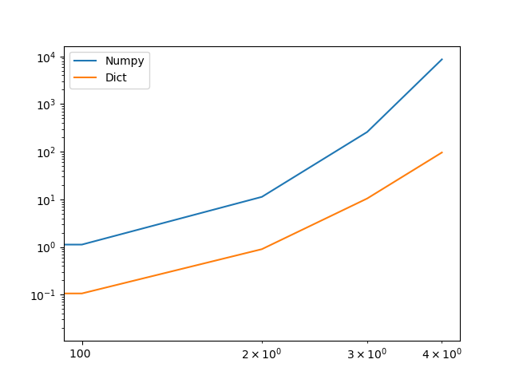

# AOC2020

[Advent of Code 2020](https://adventofcode.com/2020) Solutions and discussion

## Day 01 (Python)

- Learned about [advent-of-code-data](https://github.com/wimglenn/advent-of-code-data)
- Remembered with-open-as
- Remembered [itertools.combinations](https://docs.python.org/3/library/itertools.html#itertools.combinations)
- Remembered [math.prod](https://docs.python.org/3/library/math.html?highlight=math#math.prod) isn't built-in
- Writing inputs to a file for local work without hitting server

## Day 02 (Python)

- Started using filename for metadata
- Learned `__file__`
- Learned `l <= n < h` is a valid comparison expression

## Day 03 (Python)

- Used modulus operator `%` to wrap map

## Day 04 (Python)

- Created [aocd_setup.py] to extend automation of `aocd` to capture metadata and data, as well as for submission
- Initially had line splitting, but for some problems it's `\n\n` and for others it's `\n`, so kept it out of [aocd_setup.py]
- Learned that `>=` comparison allows for check of keys in a dictionary against a set of keys
- A lot of confusion on nested for loops about where the key:value split has to occur
- [regex101](https://www.regex101.com) to the rescue, once again
- Learned that `^` and `$` can be important so that the string must be **exactly** `{9}` characters, not a subset of greater than 9 characters

## Day 05 (Python)

- When they say "binary" you can believe them and just convert to unsigned int
- [int()](https://docs.python.org/3.6/library/functions.html#int) has built-in binary string to integer conversion
- `zip(a_list[:-1],a_list[1:])` creates a side-by-side tuple of neighboring list elements without messing with the original `a_list` somehow offset by one
- `lambda` FTW!

## Day 06 (Python)

- Set unions and intersections don't _quite_ work the same way
- Nested list comprehensions 😵

## Day 07 (Python)

- Created `AOCD_DIR` and `AOC_SESSION` environment variable using Powershell, per the [`advent-of-code-data` README](https://github.com/wimglenn/advent-of-code-data/blob/master/README.rst), as I'm on a Win10 machine
  - Per [the PowerShell docs](https://docs.microsoft.com/en-us/powershell/module/microsoft.powershell.core/about/about_environment_variables?view=powershell-7.1) the PowerShell
  script for this is

  ```PowerShell
    $Env:<variable-name> = "<new-value>"
  ```

  - So, I will now be using

  ```Python
    import os
    os.environ["AOCD_DIR"]
    os.environ["AOC_SESSION"]
  ```

  - [ ] TODO: refactor previous days' code and deprecating the use of `aocd_setup`
- Confirmed that `from aocd import data` saves input data to a file `yyyy_dd_input.txt`
  in the directory `$ENV:AOCD_DIR/$ENV:AOC_SESSION` while making data available to
  the current program as `data`.
- SO MUCH RECURSION
  - SO MUCH RECURSION
    - SO MUCH RECURSION
      - SO...
- Remembering `defaultdict` is useful when you don't want to have keyerrors,
  though maybe it's not strictly necessary here?
- [**MAJOR CONCEPTUAL BREAKTHROUGH**](https://twitter.com/nathangs20/status/1335953455152820230?s=20)
  with [pytest](https://docs.pytest.org/en/stable/)

## Day 08 (Python)

- A ton of helper functions and keeping track of state with a dictionary
- Brute force exercise for part b

## Day 09 (Python)

- More brute force, again
- `itertools.combinations()` to the rescue, again
- Some hard thinking about the verbiage of part b. Took several tries to read and understand what the problem was asking for
- JUST BECAUSE A TEST PASSES DOESN'T MEAN YOU'RE CODE IS CORRECT. Could be a "false positive" in the "test" set

## Day 10 (Python)

- Using the `zip` trick from [Day 05](#day-05), part a was just a matter of counting 1's and 3's from the `diff` of itself
- Part b took a while to ferret out the pattern, which ended up being the ["Tribonacci" sequence](https://mathworld.wolfram.com/TribonacciNumber.html) which I used a recursive function to calculate for each set of 1's

  ```Python
  def calc_series(n):
    if n == 0:
        return 1
    elif n == 1:
        return 1
    elif n == 2:
        return 2
    else:
        return calc_series(n-1) + calc_series(n-2) + calc_series(n-3)
  ```

## Day 11 (Python)

- Converted characters to numeric to make selections easier
  - `L` -> 0, empty seat
  - `#` -> 1, occupied seat
  - `.` -> -1, floor
- Padded the grid with `-1` floor to assist in neighborhood finding
- Used `numpy` to handle the seating grid and help with indexing and filtering
  - `np.where()`
- Used `itertools.product()` to generate cardinal directions for part b
- Part b marched out along each cardinal direction until hitting a boundary or a seat

## Day 12 (Python)

- Dictionaries for state again, like [Day 08](#day-08)
- Another idea would have been to use complex numbers!

## Day 13 (Python)

- Had a hunch that modulus, `%`, would be helpful, but took a bit of investigation to figure out how
- `min()` takes a `key` keyword argument that lets you select an element based on the result of a `lambda`
- Part b was just...wow. All my brute force was hopeless against the large numbers
  and even my attempt as subtly still had the counter increases by 1, instead of the
  bus ID
- <https://joepitts.co.uk/blog/advent-of-code-day-13.html> was the spoiler I needed

## Day 14 (Python)

- Setting and unsetting bits according to a mask
- The real data doesn't match the test data (multiple masks) 😭
- TDD is saving my bacon, allowing for rapid iterations for small changes
- Using `f-strings` and `itertools.product()` means legible code!

## Day 15 (Python)

- `enumerate()` is an iterator. Once the iterator object is done, there's no resetting it
- Part a used `numpy` to pre-allocate memory and do the indexing and searching
- Part b not friendly...had to do some real thinking about what information was actually necessary...namely the "spoken numbers" and the 2 most recent "turns" of the spoken number. How to encode the first time?
- Final performant implementation ended up with a dictionary that uses the spoken numbers as the **keys** and the **value** only keeps the most recent 2 turns in a tuple, with `None` in the first element as the indication that the number had only been spoken once.
- Searching dictionary keys is super fast, so finding whether a number had been spoken was sped up by a factor of about 13!
- It also has the benefit of not pre-allocating 30M array elements

Speedup results

|  Epoch | Numpy (ms) | Dict (ms)|   Multiplier |
|-------:|-----------:|---------:|-------------:|
|     10 |    0.06445 |  0.02044 |      2.15313 |
|    100 |    1.1225  |  0.10579 |      9.61064 |
|   1000 |   11.278   |  0.90012 |     11.5295  |
|  10000 |  259.385   | 10.4211  |     23.8902  |
| 100000 | 8677.73    | 96.2351  |     89.1722  |



## Day 16 (Python)

- First attempt passed the test with the example data, but not the full dataset. Likely because I used a `set()` approach and the sum is actually of all values, including repeats, though that's not crystal clear in the problem statement.
- Part a complete using a hybrid set/list approach:
  - `included set` built from the rules for ticket fields, creating ranges of values then updating the set
  - `nearby list` built from all the nearby tickets
  - `not_included list` checking whether each value (including repeats) in the nearby list are not in the included set
- First attempt at part b also figured out the fields with the example data, but not the full dataset, because the full dataset has fields with more than one applicable rule!
- The lack of complete examples to populate tests with was a downer.
- This Day consists almost entirely of:

>"Whew...figured that out...now what was the actual thing I'm trying to do??"

- Had to do some `while` loop iteration to identify which of the fields were which, but then it worked!

## Day 17 (Python)

- Another day another infinite grid, this time 3 dimensions (and **SPOILER** 4 dimensions for part b)
- Biggest issue was trying to understand the example provided.
  - Thanks to reddit for clarifying what "(and the frame of view follows the active cells in each cycle)" means
  - <https://www.reddit.com/r/adventofcode/comments/ker0wi/2020_day_17_part_1_sample_input_wrong/>
  - Once I figured out the coordinates, my test code could run
- Fortunately, the examples and the actual data matched today (no big surprises)
- I mis-identified the "twist" going from part a to part b.
  - I anticipated that it was going to be the number of cycles, so I included it as in input argument
  - Instead, it was the number of dimensions.
- Fortunately, the tweaks to include the 4th dimension weren't too bad, and even helped me get more concise in a couple areas, but I wasn't able to cleanly integrate and refactor everything.
- The unpack symbol `*` came in handy for simple range statements
- I couldn't come up with anything more clever than "only keep the active states in a dictionary" as far as data structures went, but it served me well.
- I'm sure there's a clean `itertools` way to generate the set of neighbors, but I couldn't figure it out
